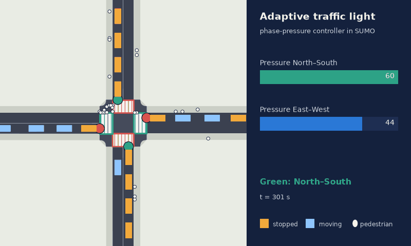
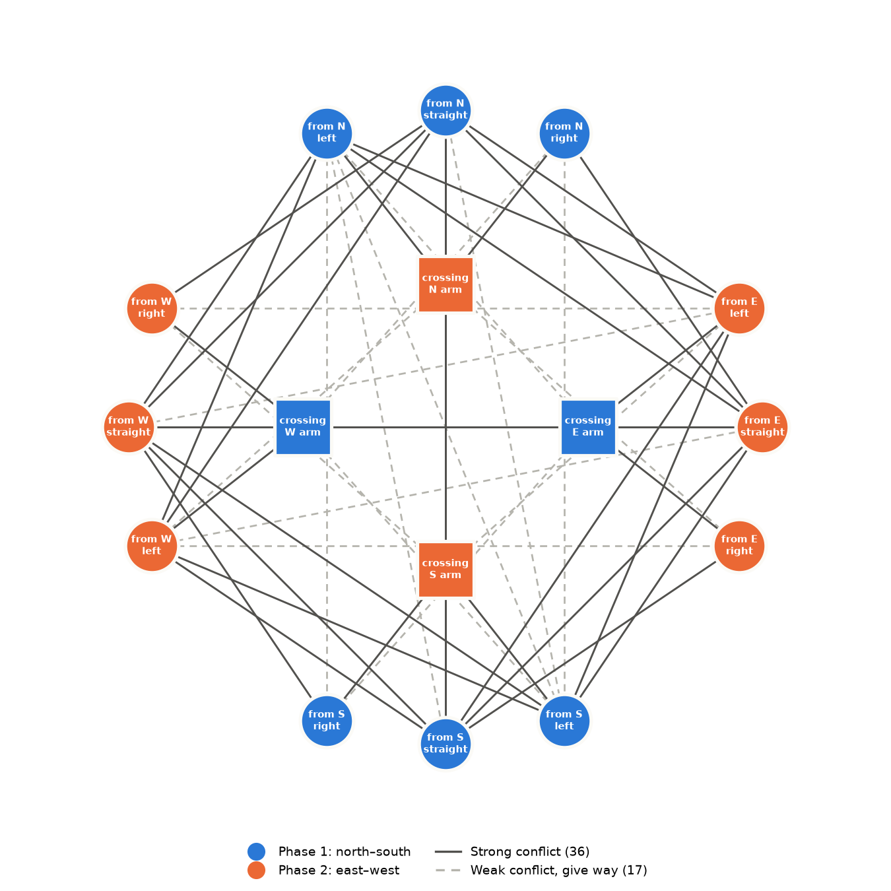
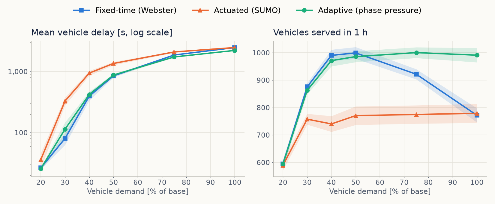

# Adaptive Urban Traffic Light Control

> **Design and simulation of a mathematical optimization algorithm for adaptive traffic lights.**

🏆 **First prize, [Premi Enginyer Pompeu Fabra 2026](https://agora.xtec.cat/iesnumancia/portada/alvaro-ayas-guanya-el-premi-enginyer-pompeu-fabra-amb-el-seu-treball-de-recerca/)**
— awarded by the School of Engineering of Universitat Pompeu Fabra to the best Batxillerat
research projects in engineering and applied mathematics.



*The adaptive controller running in SUMO at the Shibuya-type junction (real simulation; the bars
show the pressure of each phase). Generated with [`simulation/record_gif.py`](simulation/record_gif.py).*

This project presents the design, mathematical formulation, implementation, and evaluation of an **adaptive traffic light control system** capable of dynamically responding to real-time traffic conditions.

The system prioritizes traffic light phases according to the number of vehicles and pedestrians waiting at an intersection, traffic saturation, estimated queue-clearing time, pedestrian waiting time, and safety constraints.

The algorithm was implemented and evaluated using **SUMO (Simulation of Urban MObility)** and compared against traditional **fixed-time traffic light systems** across multiple intersection configurations.

---

## 📌 Overview

Urban traffic congestion remains one of the major challenges affecting modern cities. Traditional traffic lights often operate using predefined cycles, meaning that phase durations remain fixed regardless of actual traffic conditions.

This project explores an alternative approach based on a mathematical optimization model.

The proposed adaptive controller continuously evaluates the current state of an intersection and selects the traffic light phase with the highest priority according to a mathematical **phase pressure function**.

The model considers both:

* 🚗 Vehicle traffic
* 🚶 Pedestrian traffic

The objective is to improve traffic flow while ensuring that pedestrians are not continuously deprioritized.

---

## 🎯 Objectives

The main objective of this project is to design and evaluate an adaptive traffic light control system capable of improving urban traffic flow and reducing congestion compared with traditional fixed-time traffic lights.

Specific objectives include:

* Developing a mathematical optimization algorithm capable of adapting traffic light phases to changing traffic conditions.
* Implementing the algorithm within a realistic traffic simulation environment.
* Comparing adaptive control against fixed-time traffic light systems.
* Evaluating performance using objective traffic metrics.
* Analysing potential applications and limitations in real urban environments.

The initial hypothesis of the project was:

> **An adaptive traffic light system based on a mathematical optimization model can reduce the average waiting time of vehicles compared with conventional fixed-time traffic light systems.**

---

# 🧠 Mathematical Model

The proposed controller models the intersection as a discrete-time system.

At each time step:

$$
t = 0, 1, 2, ...
$$

the state of the intersection is represented by:

$$
X(t)
$$

The system includes information about:

* Number of vehicles waiting in each lane.
* Vehicle arrival rates.
* Lane service rates.
* Number of pedestrians waiting at each crossing.
* Waiting time of the oldest pedestrian.
* Currently active traffic light phase.

---

## 🚦 Phase Pressure Function

Each possible traffic light phase \(k\) is assigned a priority value:

$$
P_k(X(t))
$$

The phase pressure function combines vehicle and pedestrian demand:

$$
P_k(X(t)) =
s_k
\left[
\sum_{i \in C_k}
w_i
\frac{N_i}{\mu_i}
\frac{1}{1-\rho_i}
+
\sum_{j \in V_k}
\left(
\beta(t)N_{vj}
+
\gamma(t)T_{vj}
+
\delta
\max(0, T_{vj}-T_{crit})
\right)
\right]
$$

$$
\rho_i = \min\left(\frac{\lambda_i}{\mu_i},\ 0.95\right)
$$

Where:

### Vehicle component

* \(N_i\) → Number of vehicles waiting in lane \(i\).
* \(\lambda_i\) → Vehicle arrival rate.
* \(\mu_i\) → Lane service rate.
* \(w_i\) → Priority weight of the lane.

The vehicle term is the time needed to clear the queue while new vehicles keep arriving,
\(N_i/(\mu_i-\lambda_i)\) — the same \(1/(1-\rho)\) factor that appears in M/M/1 queueing
theory. It grows quickly as the lane approaches saturation.

---

### Pedestrian component

Pedestrian priority is determined using:

$$
\beta(t)N_{vj}
+
\gamma(t)T_{vj}
+
\delta
\max(0, T_{vj}-T_{crit})
$$

Where:

* \(N_{vj}\) → Number of pedestrians waiting.
* \(T_{vj}\) → Waiting time of the oldest pedestrian.
* \(T_{crit}\) → Critical waiting time threshold.
* \(\beta(t), \gamma(t), \delta\) → Dynamic weighting parameters.

This mechanism prevents **pedestrian starvation**, ensuring that pedestrians are eventually prioritized even during periods of high vehicle demand.

---

## 🛡️ Safety Constraints

Each phase includes a compatibility coefficient:

$$
s_k \in [0,1]
$$

Where:

* \(s_k = 1\) → The phase is safe and compatible.
* \(s_k = 0\) → The phase cannot be activated.

This ensures that unsafe traffic movements cannot be selected by the controller.

### 🕸️ The conflict graph (graph theory)

Which movements can share a phase is decided with graph theory. Each signalised movement
(a vehicle movement or a pedestrian crossing) is a **vertex**, and two vertices are joined by
an **edge** when their paths conflict. A phase is safe exactly when it is an **independent
set** of the graph of strong conflicts, and the minimum number of phases is the graph's
**chromatic number** χ.

The graphs are built automatically from the SUMO network files
([`simulation/atsc/conflict_graph.py`](simulation/atsc/conflict_graph.py)):

| Junction | Vertices | Strong / weak conflicts | χ (strong) | χ (all conflicts) |
|---|---|---|---|---|
| Simple crossing | 4 | 4 / 0 | 2 | 2 |
| Shibuya-type | 16 | 36 / 17 | 2 | 4 |

Two phases are enough only because left turns may go at the same time as oncoming traffic and
give way to it (the 17 weak conflicts). A fully protected design would need 4 phases.



---

# 🎛️ Control Policy

At every decision step, the system selects the phase with the highest pressure:

$$
F(t+1) =
\operatorname{argmax}_k
P_k(X(t))
$$

Subject to operational constraints such as:

* Minimum green time.
* Maximum green time.
* Safety requirements.
* Phase compatibility.

The controller therefore makes traffic light decisions dynamically instead of following a predefined fixed cycle.

---

# 🧪 Simulation Environment

The system was implemented and evaluated using:

**SUMO — Simulation of Urban MObility**

SUMO provides a microscopic traffic simulation environment capable of modelling:

* Vehicles.
* Pedestrians.
* Roads.
* Lanes.
* Intersections.
* Traffic lights.
* Traffic demand.

The adaptive algorithm was compared against two references that use exactly the same phases
and safety intervals: a **fixed-time plan designed with Webster's method** and **SUMO's
gap-based actuated controller**.

---

# 🏙️ Simulation Scenarios

The controller was tested across different levels of intersection complexity.

## 1. Simple Bidirectional Intersection

A basic bidirectional road with pedestrian crossings.

The scenario evaluates the controller's ability to balance:

* Vehicle queues.
* Pedestrian demand.
* Dynamic traffic flow.

---

## 2. Multiple Pedestrian Crossing Scenario

A more complex bidirectional road configuration including:

* Multiple pedestrian crossings.
* Multiple traffic lights.
* Simultaneous vehicle and pedestrian flows.

This scenario increases the complexity of the decision-making process and evaluates how the adaptive controller manages competing traffic demands.

---

## 3. Shibuya-Style Intersection

The most complex scenario developed for the project.

This environment represents a large multi-directional intersection inspired by the traffic dynamics of the **Shibuya crossing model**.

The scenario evaluates the scalability of the mathematical model under significantly higher traffic complexity.

---

# 📊 Evaluation Metrics

All controllers are measured with the same code, from SUMO's `tripinfo` output:

* **Mean vehicle delay** (time loss + insertion delay) — primary metric.
* Mean vehicle waiting time (time stopped).
* Mean and maximum pedestrian waiting time at the signalised crossings.
* Throughput (vehicles that completed their trip in the first hour).
* Delay per person (car occupancy 1.2 + pedestrians).
* CO₂ and NOx per vehicle (SUMO's HBEFA model).

Each case is simulated with **20 random seeds** over a range of demand levels, and results
are reported with 95 % confidence intervals and paired (seed-by-seed) comparisons.

---

# 📈 Results

Improvement of the adaptive controller, \(m = (W_{ref} - W_{adaptive}) / W_{ref}\), paired by
seed (20 seeds, mean ± 95 % CI; **positive = adaptive better**):

| Case | Vehicle delay vs Webster | Pedestrian wait vs Webster | Vehicle delay vs actuated | Delay per person vs Webster |
|---|---|---|---|---|
| Simple crossing, 50 % demand | −4 ± 2 % | **+41 ± 2 %** | +9 ± 2 % | +8 ± 2 % |
| Simple crossing, 100 % demand | −4 ± 3 % | **+28 ± 3 %** | **+48 ± 3 %** | +4 ± 2 % |
| Shibuya, 30 % demand | −44 ± 34 % | −32 ± 33 % | **+64 ± 9 %** | −40 ± 33 % |
| Shibuya, 100 % demand (saturated) | **+10 ± 2 %** | **+42 ± 21 %** | +10 ± 2 % | +10 ± 2 % |
| Shibuya, unbalanced demand | **+15 ± 3 %** | −3 ± 30 % | +3 ± 5 % | +15 ± 4 % |

In short:

* **Simple crossing:** vehicles lose practically the same time as with a Webster plan
  (a few tenths of a second more), while pedestrians wait 28–41 % less.
* **Shibuya-type intersection:** the adaptive controller is best when the intersection is
  saturated or the demand is unbalanced (7–15 % less vehicle delay, up to +28 % throughput).
  At intermediate demand (30–40 %) the fixed-time plan is better, most likely because the
  model assumes queues discharge at the saturation flow, which is false in shared lanes
  blocked by left-turning vehicles.
* The adaptive controller beats SUMO's actuated controller in almost every case.

The hypothesis (adaptive control reduces vehicle delay compared with fixed-time control) is
therefore **only partially confirmed**: adaptive control helps most when the intersection is
saturated or the demand is unbalanced, and a well-designed fixed-time plan is a strong
competitor otherwise.



*Shibuya-type junction, mean of 20 seeds (shaded band = 95 % confidence interval).*

Full results: [`simulation/results/`](simulation/results/) and chapter 8 of the English edition.

---

# 🌍 Potential Urban Impact

At saturated or strongly unbalanced intersections, adaptive control can reduce delay and CO₂
per vehicle by roughly 5–15 % compared with a good fixed-time plan, and by more compared with
a simple actuated controller. Quantifying the effect for a whole city such as Barcelona would
require simulating a real part of the city with measured traffic counts, since a single
isolated intersection does not represent a whole road network.

---

# 📁 Repository structure

| Path | Contents |
|---|---|
| `English/` | English edition of the thesis (`.docx` and `.pdf`) and the script that builds it from the results |
| `simulation/` | Simulation code, SUMO networks, tests and all results ([README](simulation/README.md)) |

---

# 🏗️ Project Architecture

The project can be conceptually divided into four main components:

```text
Traffic Demand
      │
      ▼
SUMO Simulation Environment
      │
      ▼
Real-Time Traffic State
      │
      ├── Vehicle queues
      ├── Arrival rates
      ├── Pedestrian queues
      └── Pedestrian waiting times
      │
      ▼
Adaptive Mathematical Controller
      │
      ▼
Phase Pressure Calculation
      │
      ▼
Phase Selection
      │
      ▼
Traffic Light Control
```

---

# 🔬 Technologies and Concepts

This project combines several areas of computer science, mathematics, and traffic engineering.

### Technologies

* **Python**
* **SUMO**
* **TraCI / SUMO simulation interface**

### Mathematical and computational concepts

* Mathematical optimization.
* Queueing theory.
* Traffic flow modelling.
* Discrete-time systems.
* Dynamic decision-making.
* Priority functions.
* Simulation modelling.

---

# 🚀 How the Adaptive Algorithm Works

The control process follows the steps below:

### 1. Collect traffic information

The system retrieves information about:

* Vehicles waiting in each lane.
* Vehicle arrival rates.
* Pedestrians waiting at crossings.
* Pedestrian waiting times.

### 2. Evaluate possible phases

Every compatible traffic light phase is analysed.

### 3. Calculate phase pressure

The mathematical pressure function calculates the priority of each phase.

### 4. Apply safety constraints

Unsafe or incompatible phases receive zero priority.

### 5. Select the optimal phase

The controller selects:

$$
\operatorname{argmax}_k P_k(X(t))
$$

### 6. Update the traffic light state

The selected phase becomes active while respecting minimum and maximum timing constraints.

### 7. Repeat

The process continuously repeats throughout the simulation.

---

# 🔄 Adaptive vs Fixed-Time Control

| Feature                              | Fixed-Time System | Adaptive System      |
| ------------------------------------ | ----------------- | -------------------- |
| Traffic response                     | ❌ No              | ✅ Yes                |
| Vehicle queue analysis               | ❌ No              | ✅ Yes                |
| Pedestrian demand                    | Limited           | ✅ Included           |
| Dynamic phase selection              | ❌ No              | ✅ Yes                |
| Traffic saturation                   | ❌ Ignored         | ✅ Considered         |
| Real-time decision-making            | ❌ No              | ✅ Yes                |
| Scalability to complex intersections | Limited           | Potentially scalable |

---

# ⚠️ Limitations

Several limitations should be considered.

* The model was evaluated primarily through simulation.
* Real-world traffic behaviour may introduce additional complexity.
* Sensor accuracy can affect system performance.
* Traffic interactions between multiple neighbouring intersections were not fully developed into a coordinated network.
* The model assumes every queue discharges at the saturation flow; in shared lanes blocked by
  left-turning vehicles this is false and the controller can waste green time.
* The weighting parameters were calibrated for two simulated intersections only.
* The model does not yet include predictive machine learning components.

These limitations provide opportunities for future development.

---

# 🔮 Future Improvements

## 🤖 Machine Learning Integration

One of the main future directions is the integration of:

* Machine Learning.
* Reinforcement Learning.
* Traffic prediction models.
* Historical traffic pattern analysis.

This could allow the system not only to react to current traffic conditions but also to anticipate future traffic demand.

---

## 🌐 Multi-Intersection Coordination

The current mathematical model can potentially be expanded into a network of coordinated intersections.

Future research could explore:

* Communication between traffic lights.
* Global traffic optimization.
* Cooperative decision-making.
* City-scale traffic networks.

---

## 📡 Real-Time Data Integration

A real-world implementation could incorporate data from:

* Cameras.
* Road sensors.
* Vehicle detection systems.
* Smart infrastructure.
* Public transportation systems.

---

# 🎓 Research Context

This repository is based on the research project:

> **Urban Traffic Optimization: Design and Simulation of a Mathematical Algorithm for Adaptive Traffic Lights**

The project investigates how mathematics, programming, queueing theory, and urban traffic simulation can be combined to develop more efficient traffic management systems.

The results show that adaptive control is a viable alternative to conventional
signals, with the clearest benefits at saturated or unbalanced intersections and for
pedestrians, while a well-designed fixed-time plan remains a strong competitor at moderate,
stable demand.

---

# 🌱 Sustainable Development

The project is related to several United Nations Sustainable Development Goals:

* **SDG 11 — Sustainable Cities and Communities**
* **SDG 13 — Climate Action**
* **SDG 3 — Good Health and Well-being**

By reducing traffic congestion, adaptive traffic management systems could potentially contribute to:

* More efficient urban mobility.
* Reduced vehicle emissions.
* Lower fuel consumption.
* Improved quality of life in urban environments.

---

# 🔮 Future Vision

This project represents a first step towards a more advanced intelligent traffic management system.

Future versions could evolve from:

```text
Fixed-Time Traffic Lights
        ↓
Adaptive Mathematical Control
        ↓
Predictive Traffic Control
        ↓
AI-Based Traffic Optimization
        ↓
Cooperative Smart City Traffic Networks
```

The long-term objective is to develop traffic light systems capable of learning from urban mobility patterns, communicating with neighbouring intersections, and making coordinated decisions across an entire traffic network.

---

# 👤 Author

**Álvaro Ayas**

Computer Science student and developer interested in:

* Artificial Intelligence
* Machine Learning
* Mathematical Modelling
* Optimization
* Intelligent Systems
* Smart Cities

---

# 📄 License

MIT License.
---

## ⭐ If you found this project interesting

Consider starring the repository or following its future development.
